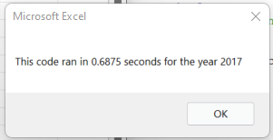
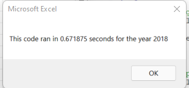
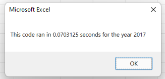
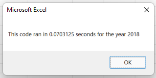

# Stock_Analysis

## Overview of Project
An original VBA script was created to analyze stock information and the stock trading volumes to determine if a stock is worth investing. To improve work efficiency of the stock analysis, I have refactored the coding based on the original VBA script. 

### Purpose
The purpose of this project is to examine whether refactored VBA script runs faster than the origianl VBA script.

The stock data used in this project are 12 stock information from 2017 and 2018 including the stock tickers, ticke rvalue, stock issued date, starting price, closing price and stock trading volumes. 

## Results

### Analysis
:star2: Below is the comparison of program run time comparison between original script and refactored script. 
As shown in the images, the run time is more than 10 times faster after code refactoring. 

 - **Original script** running time 

 
 
 
 - **Refactored script** running time 
 
 
 

:star2: The main refactored area was the loop section as shown below. After the editing, the code looks cleaner and more organized.

- **Original script** in loop section
```
'4)Loop through the tickers

   For i = 0 To 11
       ticker = tickers(i)
       totalVolume = 0
       
        '5) loop through rows in the data
       Worksheets("2018").Activate
       For j = 2 To RowCount
           '5a) Get total volume for current ticker
           If Cells(j, 1).Value = ticker Then

               totalVolume = totalVolume + Cells(j, 8).Value

           End If
           '5b) get starting price for current ticker
           If Cells(j - 1, 1).Value <> ticker And Cells(j, 1).Value = ticker Then

               startingPrice = Cells(j, 6).Value

           End If
           '5c) get ending price for current ticker
           If Cells(j + 1, 1).Value <> ticker And Cells(j, 1).Value = ticker Then

               endingPrice = Cells(j, 6).Value

           End If
       Next j
       '6) Output data for current ticker
       Worksheets("All Stock Analysis").Activate
       Cells(4 + i, 1).Value = ticker
       Cells(4 + i, 2).Value = totalVolume
       Cells(4 + i, 3).Value = endingPrice / startingPrice - 1

   Next i
```
- **Refactored script** in loop section
```
''2a) Create a for loop to initialize the tickerVolumes to zero.
    
    For i = 0 To 11
        tickerVolumes(i) = 0
        
    Next i
        
    ''2b) Loop over all the rows in the spreadsheet.
    For i = 2 To RowCount
    
        '3a) Increase volume for current ticker
        tickerVolumes(tickerIndex) = tickerVolumes(tickerIndex) + Cells(i, 8).Value
        
        '3b) Check if the current row is the first row with the selected tickerIndex.
        If Cells(i - 1, 1).Value <> tickers(tickerIndex) And Cells(i, 1) = tickers(tickerIndex) Then
            tickerStartingPrices(tickerIndex) = Cells(i, 6)
            
        End If
        
        '3c) check if the current row is the last row with the selected ticker
        'If the next row's ticker doesn't match, increase the tickerIndex.
        If Cells(i + 1, 1).Value <> tickers(tickerIndex) And Cells(i, 1) = tickers(tickerIndex) Then
            tickerEndingPrices(tickerIndex) = Cells(i, 6)
            '3d Increase the tickerIndex.
            tickerIndex = tickerIndex + 1
                
        End If
```
## Summary
Based on the above analysis and results, we can see that code refactoring helps us to review our code and lead to better quality code. But it also comes with some advantages and disadvantages. 
### Advantages
 -Refactoring makes the code easier to read and more organized
 -Refactoring decrease programming run time
### Disadvantages
 - Refactoring can be time consuming to do
 - Refactoring may not be efficient when the script is too long
